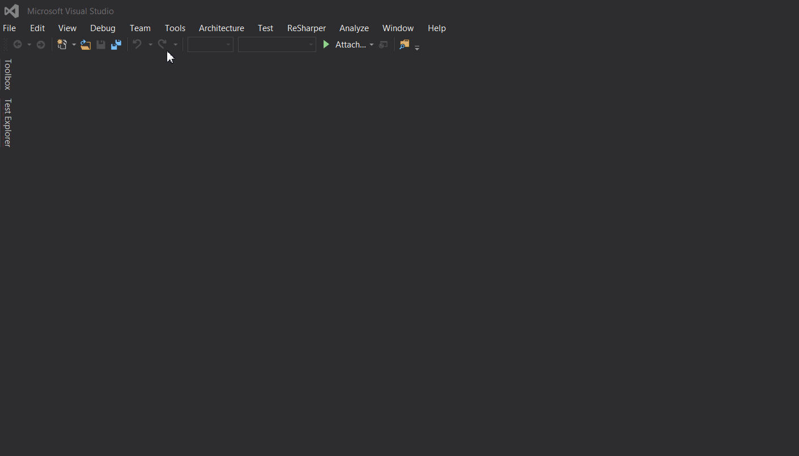
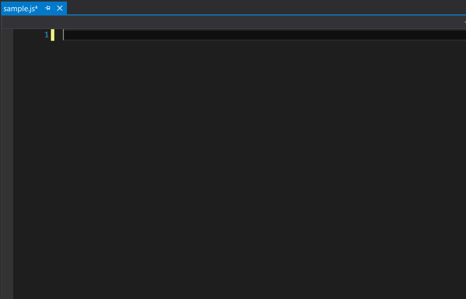

# ResharperJasmineTemplates

## Install

1. Save ResharperJasmineTemplates.DotSettings to your computer.
2. In Visual Studio, on the main menu, choose ReSharper | Tools | Templates Explorer.
3. In the Templates Explorer window that appears, click the Live Templates tab.
4. Click on Import button in the toolbar.
5. In the Open Templates File dialog that appears, locate the ResharperJasmineTemplates.DotSettings file you saved.
6. Click Open.

## Use

To use a shortcut, type the first few characters as described below and hit tab.

Supported shortcuts
* afterEach
* beforeEach
* desc
* expect
* it

